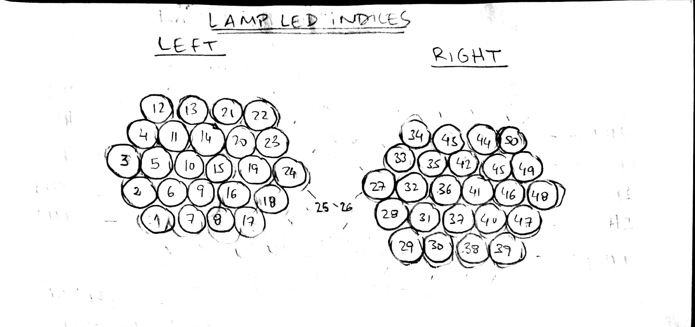

# lamp_project

## Description: 

Interactive LED-lamp with gesture sensor using Arduino.

A led strand (paste link) and plastic cups were used to assemble the lamp. (see video : [Light ball using arduino and Adafruit RGB LEDs](https://www.youtube.com/watch?v=TDI3CZhqWN4 "Video") )

The LEDs were ordered in two lamps according to the following scheme:
 

The end result looks like this:

## LEDs info:

[12mm Diffused Thin Digital RGB LED Pixels (Strand of 25) - WS2801](https://www.adafruit.com/products/322 "12mm Diffused Thin Digital RGB LED Pixels (Strand of 25) - WS2801") ---> Actually the strand I used has 50 LEDs, but it has also WS2801 chip ([Amazon link](https://www.amazon.de/gp/product/B01CACNOAI/ref=oh_aui_detailpage_o01_s00?ie=UTF8&psc=1 "Amazon link"))

## Gesture sensor info:

[Sensor: Sparkfun webpage](https://www.sparkfun.com/products/12787 "sparkfun webpage")

[Hookup guide](https://learn.sparkfun.com/tutorials/apds-9960-rgb-and-gesture-sensor-hookup-guide "Gesture sensor hookup guide")

## Requirements:

* Adafruit WS2801 library - [link here](https://github.com/adafruit/Adafruit-WS2801-Library)
* Sparkfun gesture sensor library - [link here](https://github.com/sparkfun/APDS-9960_RGB_and_Gesture_Sensor)

